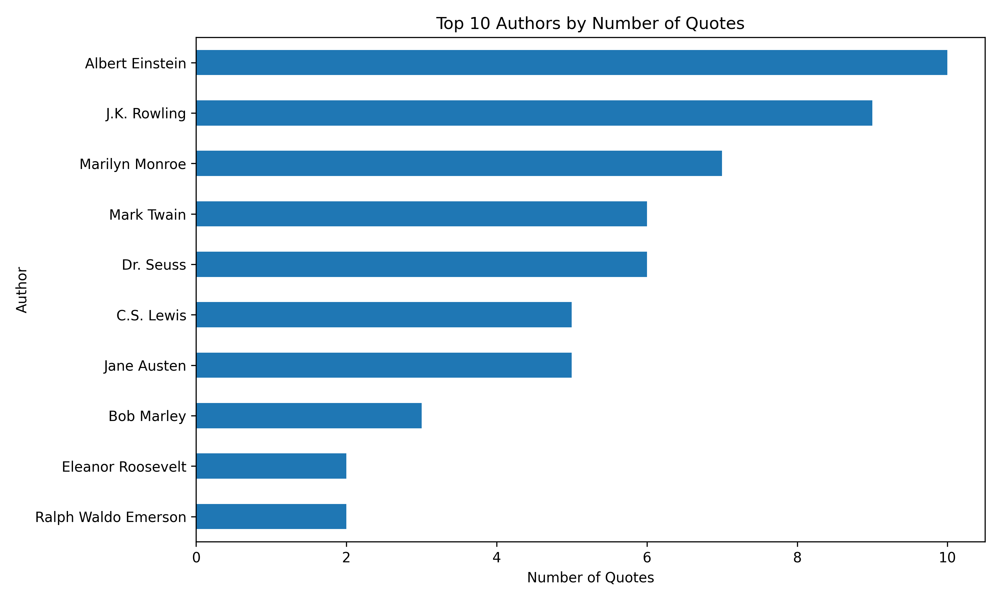
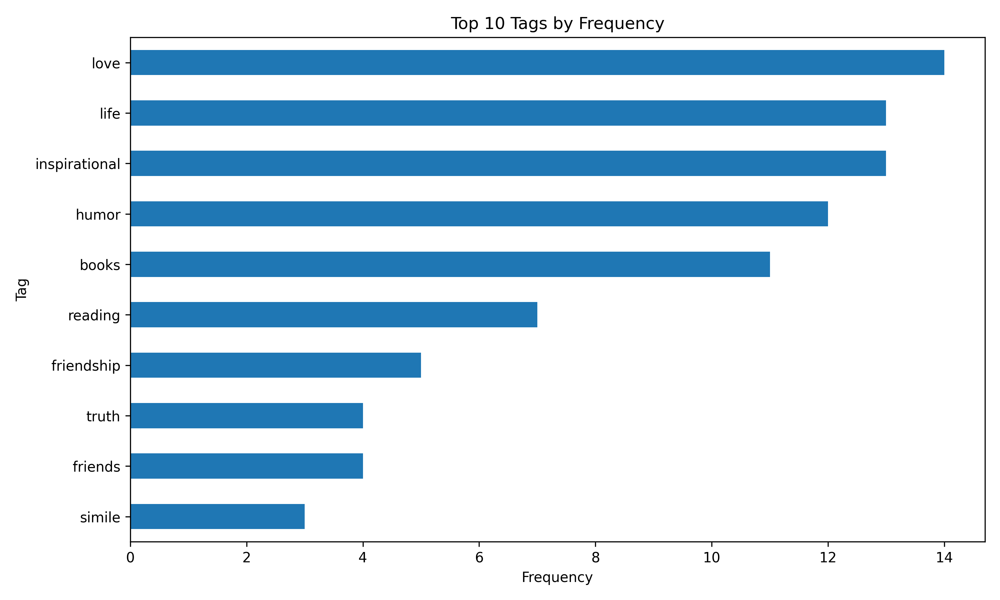
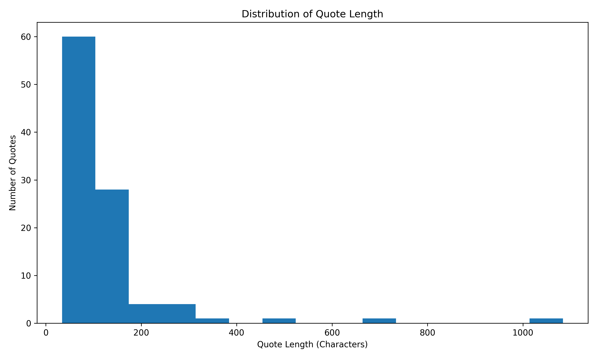
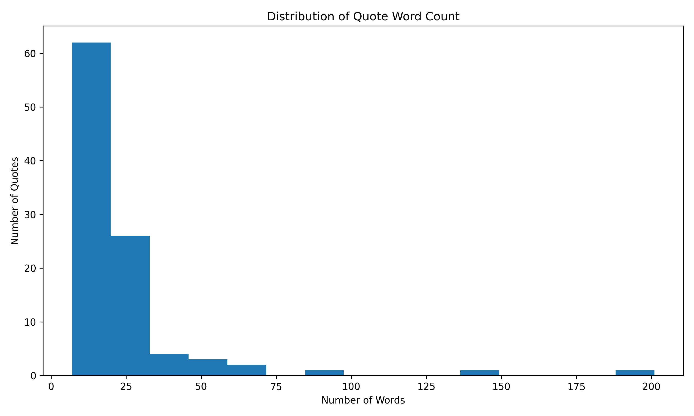
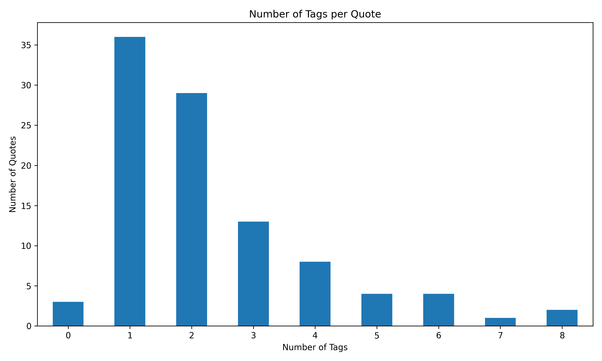
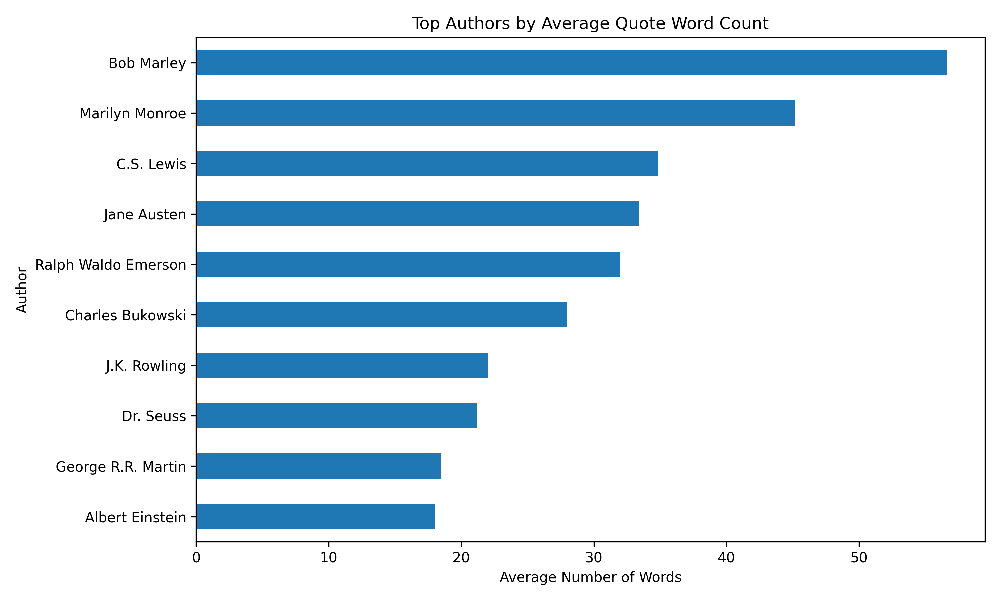

# Task 3 - Data Visualization

## Objective

The objective of this task is to transform raw data into meaningful visualizations and present insights using charts and graphs.

This project was completed as part of the CodeAlpha Data Analytics Internship.

## Dataset

The dataset used for this project was collected from the public website:

**Website:** Quotes to Scrape

**URL:** https://quotes.toscrape.com/

The dataset contains information about:

- Quotes
- Authors
- Tags

A total of 100 quote records were collected from 10 pages.

## Tools & Technologies

- Python
- Pandas
- Matplotlib
- Requests
- BeautifulSoup
- CSV

## Data Processing

The project follows these steps:

1. Collect data from the public website.
2. Extract quotes, authors, and tags using BeautifulSoup.
3. Store the collected data in a Pandas DataFrame.
4. Clean the collected data.
5. Analyze authors and tags.
6. Create visualizations using Matplotlib.
7. Save the visualizations as PNG files.

## Visualizations

The following visualizations were created:

### 1. Top 10 Authors

Shows the authors with the highest number of quotes in the dataset.



### 2. Top 10 Tags

Shows the most frequently occurring tags in the dataset.



### 3. Quote Length Distribution

Shows the distribution of quote lengths across the dataset.



### 4. Word Count Distribution

Shows the distribution of the number of words in the quotes.



### 5. Tags per Quote

Shows the number of tags associated with each quote.



### 6. Average Quote Length by Author

Shows the average length of quotes for different authors.



## Key Insights

The visualizations help identify patterns and relationships within the quote dataset.

The analysis focuses on:

- Authors with the highest number of quotes.
- Most frequently used tags.
- Distribution of quote lengths.
- Distribution of word counts.
- Number of tags associated with quotes.
- Average quote length by author.

These visualizations make the dataset easier to understand and help communicate the findings clearly.

## Project Structure

```text
Task_3_DataVisualization/
│
├── charts/
│   ├── 01_top_10_authors.png
│   ├── 02_top_10_tags.png
│   ├── 03_quote_length_distribution.png
│   ├── 04_word_count_distribution.png
│   ├── 05_tags_per_quote.png
│   └── 06_average_quote_length_by_author.png
│
├── data/
│   └── quotes_data.csv
│
├── visualization.py
└── README.md
